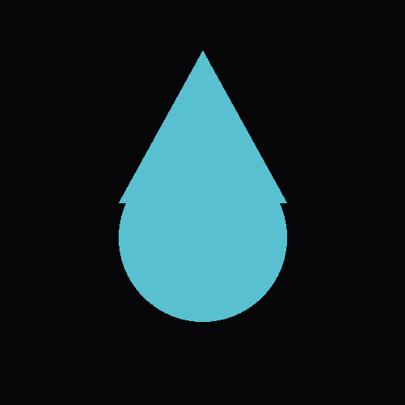

# Lọc (Filter · Strain · Purify)

A site-specific WebAR installation for the Tẻ Canal (Kênh Tẻ), Ho Chi Minh City, contributed to the collaborative installation Fabric Narratives (28th IFFTI 2026, RMIT University Vietnam).

**Live:** [binyoun.github.io/loc](https://binyoun.github.io/loc/)
